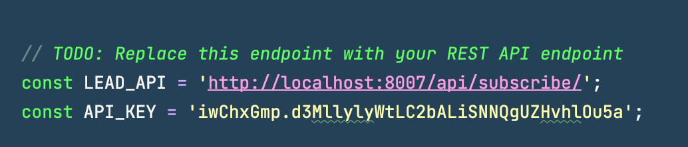
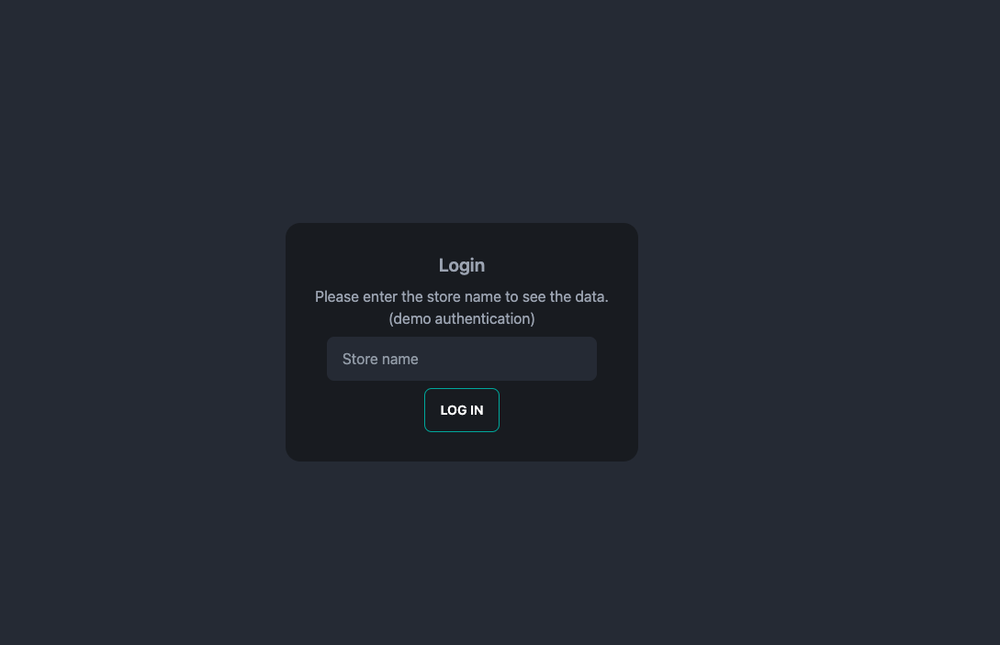
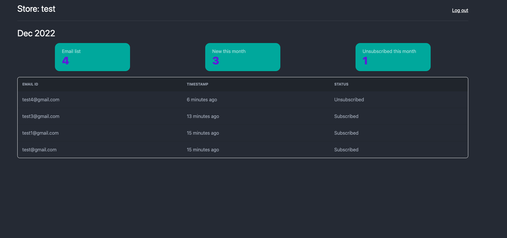

## Test for [Konigle](https://github.com/konigle/fs-task)

Requirements: [link](https://github.com/konigle/fs-task/blob/main/README.md)

## Description

### Installation

This backend is built with Django. To start the server, you need to install Docker first. Then run these command:

```bash
$ cp .env.example .env
$ docker-compose -f docker/docker-compose.yml up --build
```

Install `poetry` and `pre-commit` hooks

```bash
$ poetry install
$ poetry run pre-commit install
```

### Usage

First, we need to create a new store and generate a API key to use on the online store.

```bash
$ docker exec -it konigle_backend /bin/bash
$ python manage.py generate_key
```

The output will be something like this:

```bash
$ Successfully created API key for store: EQmyWn6w.gUMJ2S05BrI4YXpWihb6bBuD73a3uPFL
```

Copy the key and paste to the `widgets/src/widgets.js` file.



Then the widget will be available on the online store and can interact with our backend.

Next, for the store owner, to see the statistics, we access to endpoint `http://localhost:8007/email` and fill the store name.



After that, we can see the statistics of the store.



### Bonus task
This project is included with celery and celery beat for logout number of new email every Monday and Wednesday 
at midday (12:00). Start the celery and celery beat service in docker-compose.yml file.


### Checklist
- [x] Exposes an API to store the emails. Feel free to use Django REST Framework

- [x] A view to list down the emails in the reverse chronological order and show the number of new emails added this calendar month

- [x] Integrate the api with the email collection widget present in this project.

- [x] Bonus - setup a celery task that runs every Monday and Wednesday and prints the number of new emails added in the current calendar month to the console.

### Need to improve
- [ ] Add unit test
- [ ] Improve authentication. Currently, we use the store name to authenticate the store owner. It's not secure.
